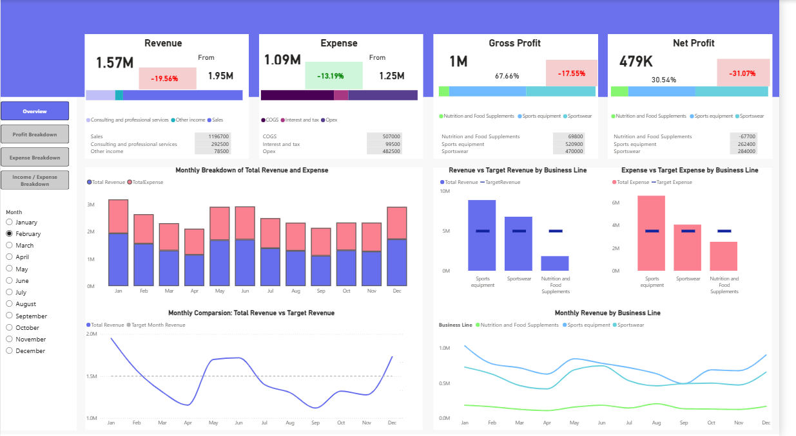
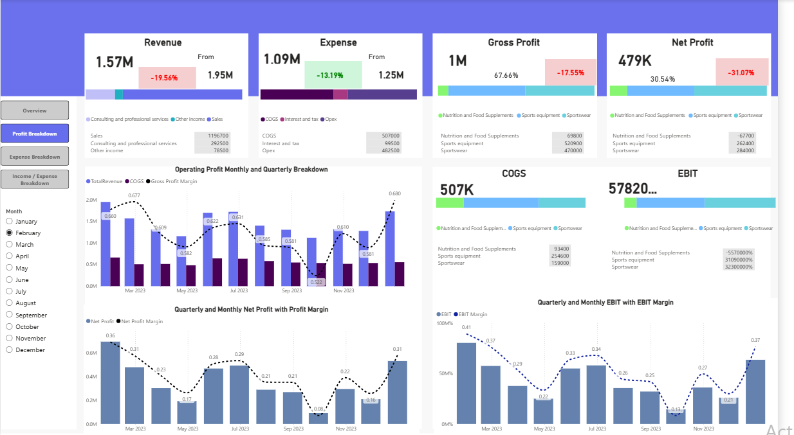
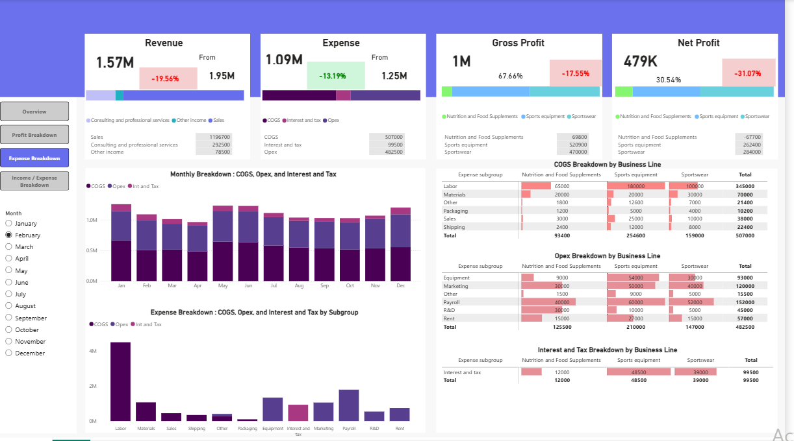
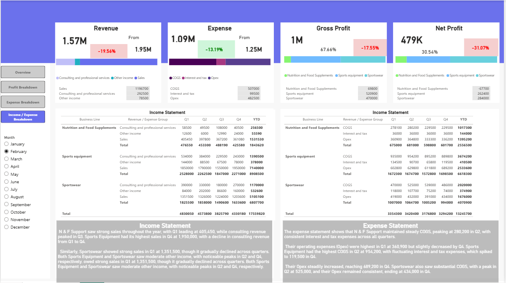

# Financial Report Dashboard – Power BI
An end-to-end Power BI dashboard analyzing revenue, expenses, and profitability across three business lines: Nutrition and Food Supplements, Sports Equipment, and Sportswear.

## Overview
This project tracks financial performance (Revenue, Expense, Gross Profit, Net Profit) with monthly trends, budget-vs-target comparisons, and full income/expense statements broken down by business line and quarter. All KPIs were custom-built using DAX measures.

## Tools
- Power BI Desktop

## Dashboard Pages
1. **Overview** – KPI summary, monthly revenue/expense trends, revenue & expense vs target by business line#
2.  **Profit Breakdown** – Operating profit, EBIT, EBIT margin, and net profit margin trends
3. **Expense Breakdown** – COGS, Opex, and Interest & Tax breakdown by month and business line
4. **Income / Expense Breakdown** – Full income statement and expense statement by quarter, business line, with narrative insights

## Dashboard Preview

## DAX Measures
This dashboard used custom DAX measures covering core financial metrics, month-over-month growth, target/budget comparisons, and dynamic conditional formatting. Full documentation with code and explanations: [DAX Measures](docs/DAX_Measures.md)

## Insights
- Nutrition and Food Supplements led Q1 sales at 405,450, while consulting revenue peaked in Q3
- Sports Equipment had its highest sales in Q4 at 1,950,000
- Sportswear showed strong Q1 sales at 1,351,500 but declined gradually across quarters

## Reference
KPI definitions and formulas used in this project are documented in [Finance Analysis](docs/Finance_Analysis.pdf).

The full interactive report is available as `FINANCE REPORT.pbix` in this repo — open it in Power BI Desktop to explore.
